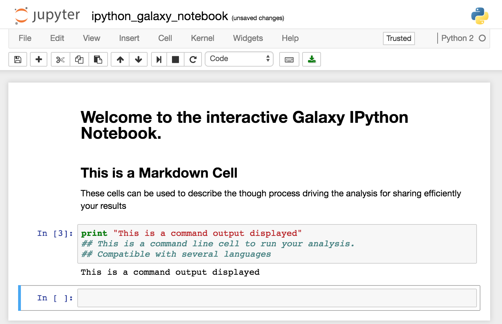
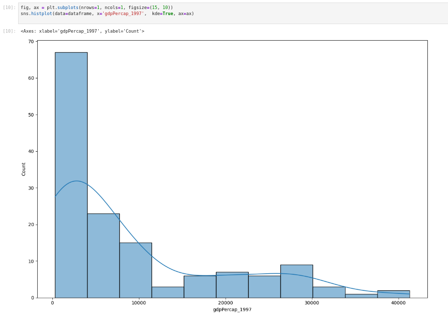

In this tutorial, we are going to explore the basics of using JupyterLab in Galaxy. We will use the Gapminder data as a test set to get the hang of Jupyter notebooks. The [python-novice-gapminder-data.zip](https://swcarpentry.github.io/python-novice-gapminder/files/python-novice-gapminder-data.zip) file is publicly available. This tutorial can also be used as an initial setup for the Software Carpentries training [Plotting and Programming in Python](https://swcarpentry.github.io/python-novice-gapminder/instructor/index.html).


> <agenda-title></agenda-title>
>
> In this tutorial, we will see :
>
> 1. TOC
> {:toc}
>
{: .agenda}


# What is Jupyter ?

[Jupyter](http://jupyter.org/) is an interactive environment that mixes explanatory text, command line and output display for an interactive analysis environment. Its implementation in Galaxy facilitates the performance of additional analysis if there is no tool for it.

These notebooks allow you to replace any in-house script you might need to complete your analysis. You don't need to move your data out of Galaxy. You can describe each step of your analysis in the markdown cells for an easy understanding of the processes, and save it in your history for sharing and reproducibility. In addition, thanks to [Jupyter magic commands](https://ipython.readthedocs.io/en/stable/interactive/magics.html), you can use several different languages in a single notebook.



You can find the complete manual for Jupyter commands [on Read the Docs](http://jupyter-notebook.readthedocs.io/en/stable/).

# Use Jupyter notebook in Galaxy

## Import data
To manipulate data first we upload the  [python-novice-gapminder-data.zip](https://swcarpentry.github.io/python-novice-gapminder/files/python-novice-gapminder-data.zip) folder into your Galaxy history. 
To add the files you can either uploade them locally from your computer or use Zenodo.

> <hands-on-title>Data upload using Zenodo</hands-on-title>
>
> 1. Create a new history for this RNA-Seq exercise
>
>    
>
> 2. Import the following tabular file from [Zenodo]({{ page.zenodo_link }}):
>    - `gapminder_all.csv` 
>    - `gapminder_gdp_africa.csv` 
>    - `gapminder_gdp_americas.csv`
>    - `gapminder_gdp_asia.csv`
>    - `gapminder_gdp_europe.csv`
>    - `gapminder_gdp_oceania.csv`
>
>    ```text
>    {{ page.zenodo_link }}/files/gapminder_all.csv
>    {{ page.zenodo_link }}/files/gapminder_gdp_africa.csv
>    {{ page.zenodo_link }}/files/gapminder_gdp_americas.csv
>    {{ page.zenodo_link }}/files/gapminder_gdp_asia.csv
>    {{ page.zenodo_link }}/files/gapminder_gdp_europe.csv
>    {{ page.zenodo_link }}/files/gapminder_gdp_oceania.csv
>    ```
>
>    
>
>
> 3. Make sure the file is imported as `CSV` by expanding the box of each imported file in your history and check the format.
> 
> If the format is not correct change the format. 
>    - Click on the pencil icon 
>    - Select the `Datatype`   tab in the middle panel
>    - In `Assign Datatype` section: change the data format to `csv` and click on `save`
>
{: .hands_on}


## Open the JupyterLab environment

Opening up your :



You should now be looking at a page with the JupyterLab interface:


As shown on the figure above, JupyterLab interface is made of 3 main areas:
- The menu bar at the top
- The left side bar with in particular the **File Browser**
- The main work area in the central panel

The Jupyter notebook can be started from different points. You can either open a Jupyter notebook from a dataset in your history or from the *Visualize* tab in the upper menu.


## Start your first notebook

Now that we are ready to start exploring JupyterLab, and open a python Notebook. There will be one pre-opened notebook available in the file browser on the left side called **ipython_galaxy_notebook.ipynb**. But we will open a new Jupyter notebook, select a kernel and give it a name.

> <hands-on-title>Start a notebook</hands-on-title>
> 
> 1. Open a new Jupyter notebook 
> 
>    There is more than one option to open a jupyter notebook. One option is:   
>  
>    - Click on **File** in the top menu bar
>    - Select **New** -> **Notebook**
>    - Choose the kernel `Python [conda env:python-kernel-3.12]` from the dropdown menu and click **select**
>
> 2. Change the kernel
>
>    If the kernel `Python [conda env:python-kernel-3.12]` was chosen in the previous step it should appear in the upper right corner of the notebook file. If not this is the location where the kernel can be switched. 
>  
>    - Click on the field that displays the current kernel e.g. `Python [conda env:base]`
>    - Now select the kernel `Python [conda env:python-kernel-3.12]` from the drop down menu
>
> 3. Name the Jupyter notebook
>
>    There are several options how to name or rename your Jupyter Notebook. One way is to: 
>  
>    - Click on **File** and select **Save File As...**
>    - Enter your file name e.g. `first_galaxy_notebook.ipynb`. Note that your file needs to end with `.ipynb`
>    - Click on **Save**
>
{: .hands_on}

## Install and import libraries using Conda

Some dependencies or programming libraries may not be available in the kernel your Jupyter Notebook is using. If that's the case, you can install or update these libraries using **Conda**.


> <hands-on-title>Install from a Conda recipe</hands-on-title>
>
> 1. Click on a cell of your notebook to edit it (verify that it is defined as a `Code` cell)
> 2. Enter the following lines : 
>    ```text
>!conda install -y pandas
>!conda install -y seaborn
>    ```
>   - The `!` indicate you are typing a bash command line (alternatively you can use `%%bash` at the beginning of your cell )
>   - The `-y` option allows the installation without asking for confirmation  (The confirmation is not managed well by notebooks)
> 3. `shift`+`return` to run the cell or click on the run cell button.
>
{: .hands_on}

Now you will be able to import this Python libraries and use them with your library code. 

> <hands-on-title>Install Python libraries using Conda</hands-on-title>
>
> 1. Click on a cell of your notebook to edit it (verify that it is defined as a `Code` cell)
>
> 2. Enter the following lines : 
>    ```python
>import pandas as pd
>import seaborn as sns
>from IPython.display import display
>import matplotlib.pyplot as plt
>    ```
> 3. `shift`+`return` to run the cell or click on the run cell button.
>
{: .hands_on}


If you wish to follow the Software Carpentries training [Plotting and Programming in Python](https://swcarpentry.github.io/python-novice-gapminder/instructor/index.html) after finishing this Jupyter Notebook introduction you should install the following Python libraries.

> <hands-on-title>Install Python libraries for a Python introduction</hands-on-title>
>
> 1.  Copy the following install commands and pasted them into a empty cell of your Notebook
>    ```text
>!conda install -y math
>!conda install -y matplotlib
>!conda install -y glob
>!conda install -y pathlib
>    ```
>
> 2. press `shift`+`return` to run the cell or click on the run cell button.
>
{: .hands_on}


## Import data 
If you want to include datasets from your history into your  Jupyter notebook, you can import them  using the `get(12)` command, with the number of your dataset in the history (If you are working on a collection, unhide datasets to see their numbers).
You can use the `gapminder_gdp_europe.csv` file. You can save all of the files into a path location first, to later refer to this file using the import path variable.

> <hands-on-title>Import file location from your history</hands-on-title>
>
> Save the import file location to a variable (`file_import`) name with the `get()` function.
>    ```python
>file_import = get("[file_number]")
>    ```
>    - The files are referenced in Jupyter by their number in the history.
>    - The variable `file_import` now stores the location where your file can be imported from.
>
{: .hands_on}

If you wish to follow the python training later you should import all of the gapminder datasets now. The `file_import` variables can be treated like the path with the tutorial. 

> <hands-on-title>Import file location from your history</hands-on-title>
>
> 1. Find the `file_numbers` of all of the gapminder datasets (`gapminder_all.csv`, `gapminder_gdp_africa.csv`, `gapminder_gdp_americas.csv`, `gapminder_gdp_asia.csv`, `gapminder_gdp_europe.csv`, `gapminder_gdp_oceania.csv`) with your galaxy history
> 2. Load the datasets `file_import`into your Ipython notebook:
>    ```python
>gapminder_all_import = get("[file_number]")
>gapminder_gdp_africa_import = get("[file_number]")
>gapminder_gdp_americas_import = get("[file_number]")
>gapminder_gdp_asia_import = get("[file_number]")
>gapminder_gdp_europe_import = get("[file_number]")
>gapminder_gdp_oceania_import = get("[file_number]")
>    ```
>    - The files are referenced in Jupyter by their number in the history.
>    - The variable `file_import` now stores the location where you file can be imported from
>
{: .hands_on}


## Graph Display in Jupyter

In this tutorial we are going to plot a distribution graph of our data. For this we will first need to load one of our tabular data files. You can use the `gapminder_all.csv` file.

> <hands-on-title>Load a file from your history</hands-on-title>
>
> 1. Open the dataset as a pandas DataFrame with the function.
>    ```python
>dataframe = pd.read_csv(file_import)
>    ```
>    - The files are referenced in Jupyter by their number in the history.
>
{: .hands_on}


> <hands-on-title>Draw a distribution plot</hands-on-title>
>
> 1. Create your figure with the command 
>    ```python
>fig, ax = plt.subplots(nrows=1, ncols=1, figsize=(15, 10))
>    ```
>   -  `nrows=1, ncols=1` means you will have one plot in your figure (one row and one column)
>   -  `figsize` parameter determines the size of the figure
> 2. Draw the distribution plot of the second column of our dataset with the command
>    ```python
>sns.histplot(data=dataframe, x='gdpPercap_1997',  kde=True, ax=ax)
>    ```
> 
>
{: .hands_on}


## Export Data


If you want to save a file you generated in your notebook, use the `put("file_name")` command. That is what we are going to do with our distribution plot.

> <hands-on-title>Save an Jupyter-generated image into a Galaxy History</hands-on-title>
>
> 1. Create an image file with the figure you just drew with the command
>    ```python
>fig.savefig('distplot.png')
>    ```
> 2. Export your image into your history with the command  
>    ```python
>put('distplot.png')
>    ``` 
>
{: .hands_on}


## Save the Notebook in your history

Once you are done with your analysis or anytime during the editing process, you can save the notebook into your history using the `put("first_galaxy_notebook.ipynb")`. If you create additional notebooks with different names, make sure you save them all before you quit JupyterLab.

This will create a new notebook `.ipynb` file in your history every time you click on this icon.

> <hands-on-title>Closing JupyterLab</hands-on-title>
>
> 1. In the Galaxy interface click on  **Interactive Tools** button on the left side.
>
> 2. Tick  the box of your Jupyter Interactive Tool, and click **Stop**.
>
{: .hands_on}

If you want to reopen your Jupyter Notebook again you will start a new **Jupyter Interactive Tool** and 


# Conclusion


 You have just performed your first analysis in Jupyter notebook integrated environment in Galaxy. You generated an distribution plot that you saved in your history along with the notebook to generate it.
If you wish to follow the Software Carpentries training [Plotting and Programming in Python](https://swcarpentry.github.io/python-novice-gapminder/instructor/index.html) training now, you can open a Jupyter notebook install all needed dependencies and upload all file locations from the Gapminder dataset using the `get('file_number')` function (e.g. `gapminder_all_file = get(12)`). You can use this file location now throughout the tutorial once you need to specify the file path. Meaning, if the tutorial ask you to load a dataset like this `data_oceania = pd.read_csv('data/gapminder_gdp_oceania.csv')`you can replace the path `'data/gapminder_gdp_oceania.csv'`with our file_import variable: `data_oceania = pd.read_csv(gapminder_gdp_oceania_import)`.
You can start directly from [**The-jupyterlab-interface**](https://swcarpentry.github.io/python-novice-gapminder/instructor/01-run-quit.html#the-jupyterlab-interface) section of the tutorial. 