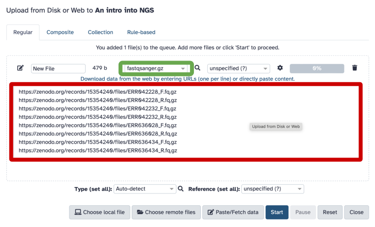
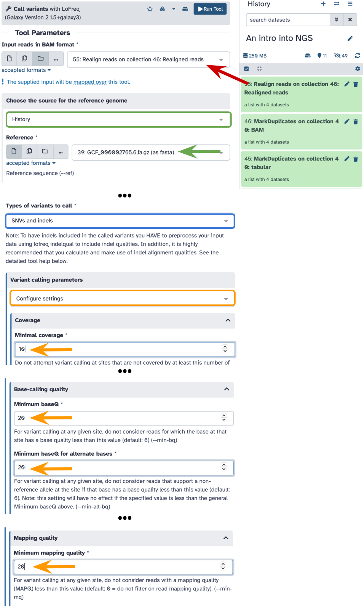
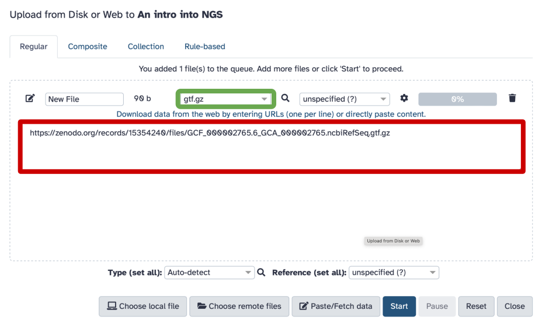
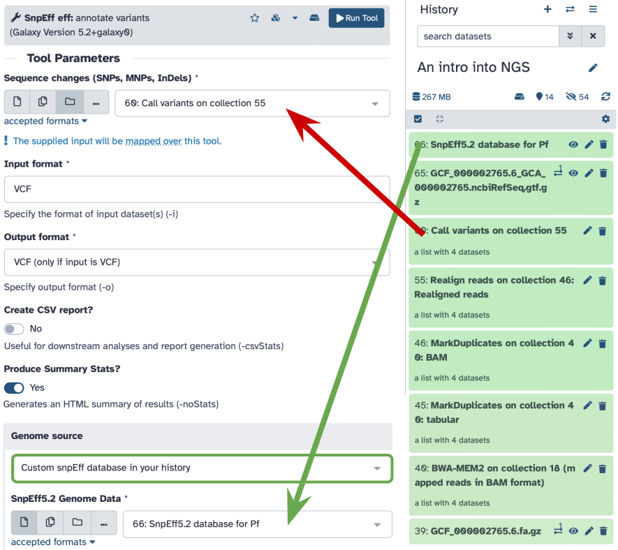
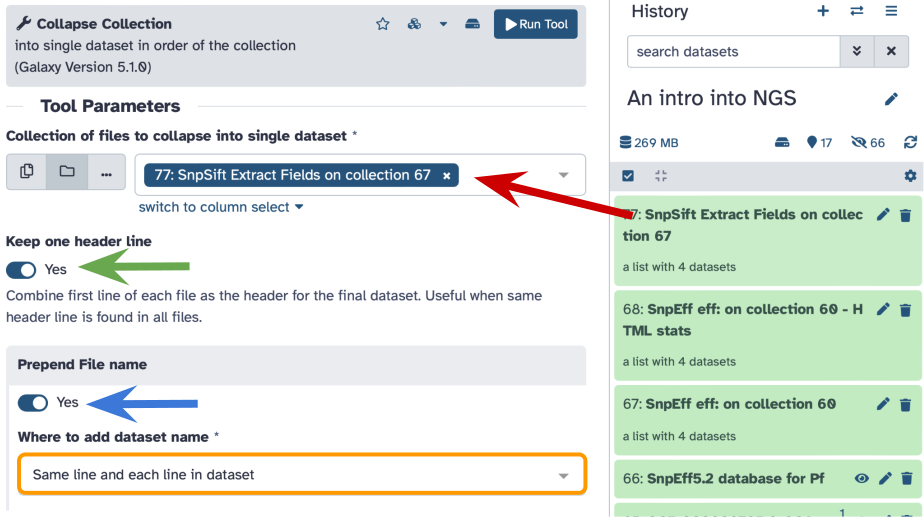

<!--

ALL IMAGES USED IN THIS TUTORIAL ARE AVIALABLE IN EDITABLE FORM HERE:

https://drive.google.com/drive/folders/0B7a9KfygumZFYWxIZlJqSkJwc2c?resourcekey=0-C7W_lazWNzjkKiplb9y01A&usp=sharing

-->

In this section, we will look at practical aspects of manipulation of next-generation sequencing data. We will start with the FASTQ format produced by most sequencing machines and will finish with a table of variants present in four human samples we will analyze.

# The Story

To make this tutorial as realistic as possible we wanted to use an example from the real world. We will start with four sequencing datasets (fastq files) representing four individuals positive for malaria---a life-threatening disease caused by *Plasmodium* parasites---transmitted to humans through the bites of infected female *Anopheles* mosquitoes. 

Our goal is to understand whether the malaria parasite ([*Plasmodium falciparum*](https://brc-analytics.dev.clevercanary.com/data/organisms/5833)) infecting these individuals is resistant to [Pyrimethamine](https://en.wikipedia.org/wiki/Pyrimethamine)---an antimalarial drug. Resistance to Pyrimethamine is conferred by a mutation in `PF3D7_0417200` (*dhfr*) gene (). Given sequencing data from four individuals we will determine which one of them in infected with a *Plasmodium falciparum* carrying mutations in this gene.

An outline of our analysis looks like this:

 and reverse reads (blue). Before analysis begins these files are combined into a <i>Collection</i>. This allows processing all of them at once. The data is mapped against a reference genome of <i>P. falciparum</i>. This produces a series of BAM files. The BAM files are further passed through a variant caller. This produces VCF files. VCF files are then converted to tabular format and concatenated to create one final dataset. This dataset contains the answer the our question: which of the individual carries drug resistant mutations.").

# From reads to variants

In this tutorial we will use data from four infected individuals sequenced within the [MalariaGen](https://www.malariagen.net/data_package/open-dataset-plasmodium-falciparum-v70/) effort. We use the following four samples:

| Accession | Location |
|------------|------------|
| [ERR636434](https://www.ncbi.nlm.nih.gov/sra/?term=ERR636434) | Ivory coast |
| [ERR636028](https://www.ncbi.nlm.nih.gov/sra/?term=ERR636028) | Ivory coast |
| [ERR042232](https://www.ncbi.nlm.nih.gov/sra/?term=ERR042232) | Colombia |
| [ERR042228](https://www.ncbi.nlm.nih.gov/sra/?term=ERR042228) | Colombia |

These accessions correspond to datasets stored in the [Sequence Read Archive](https://www.ncbi.nlm.nih.gov/sra) at NCBI.

Let's do that 🚀

## Upload data into Galaxy

For this tutorial we down-sampled the data (made datasets smaller) to make sure that you can go through it quickly. We deposited these datasets in a Zenodo library. Let's upload these datasets into Galaxy!

> <hands-on-title>Upload accessions into Galaxy</hands-on-title>
>
> 1. Go to your Galaxy instance of choice such as one of the [UseGalaxy.* instances](https://galaxyproject.org/usegalaxy/) or any other.
> 1. Click *Upload Data* button:
> 
> 1. In the dialog box that would appear click "*Paste/Fetch*" button
> 
> 1. Paste the following accessions into the box (red box in the image below):
> ```
> https://zenodo.org/records/15354240/files/ERR042228_F.fq.gz
> https://zenodo.org/records/15354240/files/ERR042228_R.fq.gz
> https://zenodo.org/records/15354240/files/ERR042232_F.fq.gz
> https://zenodo.org/records/15354240/files/ERR042232_R.fq.gz
> https://zenodo.org/records/15354240/files/ERR636028_F.fq.gz
> https://zenodo.org/records/15354240/files/ERR636028_R.fq.gz
> https://zenodo.org/records/15354240/files/ERR636434_F.fq.gz
> https://zenodo.org/records/15354240/files/ERR636434_R.fq.gz
> ```
> 1. Change datatype to `fastqsanger.gz` (green box in the image below) 
> 
> 1. Click *Start* button
> 1. Close dialog by pressing **Close** button
> This will create eight datasets in your history on the right side of the interface:
> 
> There are eight datasets because each sample has *forward* and *reverse* read files associated with it, so 4 &#215; 2 = 8
> 
{: .hands_on}

## Bundle data into *Collection*

We are going to perform exactly the same analysis on all four samples. So it does not make sense to repeat the same operation eight times (imagine if you had a hundred or a thousand datasets). So before we go any further we will bundle the datasets we have in the history into a *Collection*. *Collections* in Galaxy are logical groupings of datasets that reflect the semantic relationships between them in the experiment / analysis. In this case, we will create a *paired collection* that will have two "levels"  (For more information on Collections see the [Collections tutorial]():


> <hands-on-title>Creating a paired-collection</hands-on-title>
>
> To create a paired collection follow the steps shown in the video below (the video is 52 seconds long 😁):
>
> <iframe width="560" height="315" src="https://www.youtube.com/embed/An4e7wr-FbU?si=iFN9BoNYy2p34LD9" title="YouTube video player" frameborder="0" allow="accelerometer; autoplay; clipboard-write; encrypted-media; gyroscope; picture-in-picture; web-share" referrerpolicy="strict-origin-when-cross-origin" allowfullscreen></iframe>
>
> Explore the collections by first **clicking** on the collection name in the history panel. This takes you inside the collection and shows you the datasets in it.  You can then navigate back to the outer level and, finally, full history.
>
{: .hands_on}

<!-- The above embedding uses iframe because include _includes/youtube.html does not work from within hands-on section -->

## Assessing the quality of the data with **fastp** and **multiqc**

Raw fastq data is often contaminated with fragments of sequencing adapters used in library preparation and contain low quality reads or reads with low quality portions.  can automatically detect widely used sequencing adapters and remove them as well as prune low quality segments from reads. So, let's pass our data through **fastp**:

> <hands-on-title>Running <b>fastp</b></hands-on-title>
>
> Run  with the following parameters:
>
>    - "*Single-end or paired reads*": `Paired collection` (<font color="red">red outline</font>).
>    - "*Select paired collection(s)*": Collection we created in the previous step (<font color="red">red arrow</font>).
> 
>  
>
> Fastp modifies files by removing standard Illumina adapters and applies a number of quality filters generating "Cleaned up data" shown above) as well as HTML and JSON reports as three collections: 
>
>  
>
{: .hands_on}

You can click on individual HTML reports to get an idea about the quality of the data and degree of "cleanup". However, clicking on each dataset individually can become problematic if the number of datasets is large (you don't want to click on hundred datasets, do you?). We can visualize the QC data provided by **fastp** for **ALL** samples by feeding its JSON output to :

> <hands-on-title>Running <b>multiqc</b> on <b>fastp</b> JSON data</hands-on-title>
>
> Run  with the following parameters:
> 
>    - "*Which tool was used to generate logs?*": `fastp` (<font color="red">red outline</font>).
>    - "*Output of fastp*": JSON output generated by **fastp** at the previous step (<font color="red">red arrow</font>).
> 
>  
>
> `multiqc` will produce two outputs, but the one you care about has a work "Webpage" in it:
>
>  
>
> Click on the  (eye) icon and you will the QC report.
>
{: .hands_on}

Figure below shows one of the plots produced by `multiqc`---distribution of quality values across positions for forward reads after processing.

 

We can now proceed to mapping the reads.

## Mapping reads

Galaxy has a number of mappers including **bowtie**, **bwa-mem**, and **bwa-mem2**. For this analysis we will use ---the latest version of this popular and "battle-tested" tool. 

### Upload reference genome

The key question when mapping reads against a genome is whether the index for this genome---a datastructure **bwa-mem2** uses to quickly find matches---is already installed on Galaxy or not. Let's assume that it is **NOT** present in Galaxy. In this case you will need to upload the genome. In this case we will use reference genome of 3D7 strain *P. faciparum*.

> <hands-on-title>Uploading the genome for <i>P. falciparum</i></hands-on-title>
> 
> To download the genome paste the following URL into the  tool:
>
> ```
>  https://zenodo.org/records/15354240/files/GCF_000002765.6.fa.gz
> ```
> The only difference is that here with example we've see above is that you need to set datatype (green box) to `fasta.gz`:
>  
>
{: .hands_on}

### Map the reads

Now we can map the reads against the uploaded genome:

> <hands-on-title>Map sequencing reads with <b>bwa-mem</b></hands-on-title>
>
> Run  with the parameters shown in the image below:
>
>    - "*Will you select a reference genome from your history or use a built-in index?*": `Use a reference genome from history and build index if necessary` (<font color="red">red outline</font>).
>    - "*Use the following dataset as the reference*": Choose the reference we uploaded at the previous step (<font color="red">red arrow</font>).
>    - "*Single or Paired-end reads*": `Paired collection` (<font color="green">green outline</font>).
>    - "*Select a paired collection*": Select the collection of fastq datasets produced by **fastp** (<font color="green">green arrow</font>).
>
> 
>
{: .hands_on} 

### Remove duplicates

In many cases there could be artifacts that can be detected in mapped reads. One of such artifacts are duplicate reads. Removing duplicates is particularly important for identification of sequence variants as they can affect their frequencies. It is performed with the  tool:

> <hands-on-title>Remove duplicates</hands-on-title>
>
> Run  with the following parameters:
>    -  *"Select SAM/BAM dataset or dataset collection"*: `bam_output` (output of ) as shown with the <font color="red">red arrow</font>.
>    - *"If true do not write duplicates to the output file instead of writing them with appropriate flags set"*: `Yes` as shown with <font color="green">green arrow</font>.
>
> 
{: .hands_on}

## Calling variants

Now we are ready to proceed with variant calling. For this purpose we will a tool called **lofreq**. One thing to keep in mind in our case is that the samples are from human blood. In humans *Plasmodium* parasites exist in **haploid** state (only zygote is diploid and this stage happens in mosquito). **lofreq** is specifically designed for calling variants in this scenario. 

### Realign reads

One of the key issues with accurate identification of sequence variants is normalizing indels (insertions and deletions).

> <details-title>What is the problem with indels?</details-title>
>
>Left aligning of indels (a variant of re-aligning) is extremely important for obtaining accurate variant calls. For illustrating how left-aligning works, we expanded on an example provided by Tan et al. [2015](https://doi.org/10.1093/bioinformatics/btv112). Suppose you have a reference sequence and a sequencing read:
>
>
>```
>Reference GGGCACACACAGGG
>Read      GGGCACACAGGG
>```
>
>If you look carefully you will see that the read is simply missing a `CA` repeat. But it is not apparent to a mapper, so some of possible alignments and corresponding variant calls include:
>
>```
>Alignment                 Variant Call
>
>GGGCACACACAGGG            Ref: CAC
>GGGCAC--ACAGGG            Alt: C
>
>GGGCACACACAGGG            Ref: ACA
>GGGCA--CACAGGG            Alt: A
>
>GGGCACACACAGGG            Ref: GCA
>GGG--CACACAGGG            Alt: G
>```
>
>While we cannot know which of these arrangements is correct, left-aligning guarantees consistency.
>
{: .details}

 is a part of **lofreq** package. It corrects misalignment around insertions and deletions:

> <hands-on-title>Realign reads around indels</hands-on-title>
>
> Run  with the following parameters:
>    -  *"Reads to realign"*: output of  as shown with the <font color="red">red arrow</font>.
>    - *"Choose the source for the reference genome"*: `History`
>        -  *"Reference"*: set this to the [previously uploaded reference genome](#hands-on-uploading-the-genome-for-i-p-falciparum-i-10) (<font color="green">green outline and arrow</font>).
>
> 
>    
{: .hands_on}

### Call Variants using lofreq **Call variants**

We are now ready to actually call variants:

> <hands-on-title>Call variants</hands-on-title>
>
> Run  with the following parameters:
>    -  *"Input reads in BAM format"*: Output of  (<font color="red">red arrow</font>)
>    - *"Choose the source for the reference genome"*: `History` (<font color="green">green outline</font>).
>        -  *"Reference"*: set this to the [previously uploaded reference genome](#hands-on-uploading-the-genome-for-i-p-falciparum-i-10) (<font color="green">green outline and arrow</font>).
>    - *"Types of variants to call"*: `SNVs and indels` (<font color="blue">blue outline and arrow</font>).
>    - *"Variant calling parameters"*: `Configure settings` (<font color="orange">orange outline</font>).
>        - In *"Coverage"*:
>            - *"Minimal coverage"*: `10` (<font color="orange">orange arrow</font>).
>        - In *"Base-calling quality"*:
>            - *"Minimum baseQ"*: `20` (<font color="orange">orange arrow</font>).
>            - *"Minimum baseQ for alternate bases"*: `20`  (<font color="orange">orange arrow</font>).
>        - In *"Mapping "quality*": 
>            - *"Minimum mapping quality"*: `20` (<font color="orange">orange arrow</font>).
>
> 
{: .hands_on}

The output of this step is a collection of [VCF](https://en.wikipedia.org/wiki/Variant_Call_Format) files containing information on all variants found between the reads and the reference genome.

## Annotating variants

### Preparing  database

We will now annotate the variants we called in the previous step with the effect they may have on the *Plasmodium* phenotype. In order to do this we need to create a database that can be used by . This process requires a reference genome (which we already uploaded and a list of genes present in this genome---a file we have not uploaded yet. 

> <hands-on-title>Uploading gene annotations for <i>P. falciparum</i></hands-on-title>
> 
> To download gene annotations paste the following URL into the  tool as was shown previously in this tutorial already twice (for fastq files and for reference genome).
>
> ```
>  https://zenodo.org/records/15354240/files/GCF_000002765.6_GCA_000002765.ncbiRefSeq.gtf.gz
> ```
> Set datatype (<font color="green">green</font> box) to `gft.gz`:
>
>  
>
{: .hands_on}

Now we can run :

> <hands-on-title>Prepare snpEff database with <b>SnpEff Build</b></hands-on-title>
> 
> Run  with the following parameters:
>
>    - *"Name for the database"*: `Pf` (<font color="red">red arrow</font>).
>    - *"Input annotations are in"*: `GTF` (<font color="green">green arrow</font>).
>    - *"GTF dataset to build database from"*: Select the GTF file uploaded at the previous step (<font color="blue">blue arrow</font>).
>    - *"Choose the source for the reference genome"*: `History` (<font color="orange">orange outline</font>).
>    - *"Genome in FASTA format"*: Choose reference genome uploaded earlier (<font color="orange">orange arrow</font>).
>
>  
>
{: .hands_on}

### Annotate variant effects with **SnpEff eff**

We are now ready to annotate variants with  (here "eff" stands for effect):

> <hands-on-title>Annotate variant effects</hands-on-title>
>
> Run  with the following parameters:
>    -  *"Sequence changes (SNPs, MNPs, InDels)"*: Output of  we've run previously <font color="red">red arrow</font>)
>    - *"Genome source"*: `Custom snpEff database in your history` <font color="green">green outline</font>)
>      - "*SnpEff5.2 Genome Data*": set to the SnpEff database we built in the previous step <font color="green">green arrow</font>)
>   
>
>
{: .hands_on}

### Create table of variants using **SnpSift Extract Fields**

Previous step generated a set of annotated VCF files. These can be visualized in a genome browser, but we will go a different way. We will convert them into tab-delimited files that can be easily processed. 

> <hands-on-title>Create table of variants</hands-on-title>
>
> Run  with the following parameters:
>    -  *"Variant input file in VCF format"*: Output of  from previous step (<font color="red">red arrow</font>)
>    - *"Fields to extract"*: Copy the following string into a box highlighted with (<font color="green">green outline</font>):
>
> ```
>CHROM POS REF ALT QUAL DP AF SB DP4 ANN[*].EFFECT ANN[*].IMPACT ANN[*].GENE ANN[*].AA_POS ANN[*].HGVS_C ANN[*].HGVS_P
> ```
>
>    - *"One effect per line"*: `Yes` (<font color="blue">blue arrow</font>)
>
> 
>
{: .hands_on}

Let's explain which fields we are extracting:

| # | Field | Meaning |
|---|----------|-------------|
| 1 | `CHROM` | Name of the chromosome | 
| 2 | `POS` | Position within that chromosome |
| 3 | `REF` | Reference allele (the one present in the *reference* |
| 4 | `ALT` | Alternative allele (the one observed in the reads) |
| 5 | `QUAL` | Variant quality computed by **lowfreq** |
| 6 | `DP` | Read depth (the number of reads covering this position) |
| 7 | `AF` | Alternative allele frequency |
| 8 | `SB` | Strand bias P-value from Fisher's exact test calculated by lofreq |
| 9 | `DP4` | Depth for Forward Ref Counts, Reverse Ref Counts, Forward Alt Counts, Reverse Alt Counts |
| 10 | `ANN[*].EFFECT` | Expected effect of the variant on the protein |
| 11 | `ANN[*].IMPACT` | Expected impact of the phenotype |
| 12 | `ANN[*].GENE` | Name of the gene containing the variant |
| 13 | `ANN[*].AA_POS `| Amino acid position within the gene affected by this variant |
| 14 | `ANN[*].HGVS_C` | Nucleotide change in nucleotide coordinates relative to the start of the coding region |
| 15 | `ANN[*].HGVS_P` | Amino acid change in amino acid coordinates relative to the start of the protein |

### Collapse data into a single dataset

We now extracted meaningful fields from VCF datasets. But they still exist as a collection. To move towards secondary analysis we need to **collapse** this collection into a single dataset. "Collapsing" simply concatenates the content of collection elements and attaches sample IDs, so that we know which line in the concatenated file corresponds to which sample:

 is pre-pended with the element's name such as 1, 2, 3, and 4.")

For more information about collapsing collections, please watch the following YouTube video:



> <hands-on-title>Collapse a collection</hands-on-title>
>
> Run  with the following parameters:
>    -  *"Collection of files to collapse into single dataset"*: Output of  from the previous step (<font color="red">red arrow</font>).
>    - "*Keep one header line*": `Yes` (<font color="green">green arrow</font>)
>    - "*Prepend File name*": `Yes` (<font color="blue">blue arrow</font>)
>    - "*Where to add dataset name*": `Same line and each line in dataset` (<font color="orange">orange outline</font>)
>
> 
>
{: .hands_on}

You can see that this tool takes lines from all collection elements (in this tutorial we have two), add element name as the first column, and pastes everything together. So, if we have a collection as an input:

> <code-in-title>A collection with two items (<b>15</b> columns)</code-in-title>
> A collection element named `ERR042228.fq`
>
>```
>NC_004318.2   676399   C    T     1344.0   45   0.977778   0   0,0,23,22   missense_variant    MODERATE PF3D7_0415200   914     c.2740G>A    p.Glu914Lys   
>NC_004318.2   676631   C    T     2000.0   60   0.966667   0   0,0,32,27   synonymous_variant  LOW      PF3D7_0415200   836     c.2508G>A    p.Lys836Lys   
>```
>
>A collection element named `ERR042232.fq`:
>
>```
>NC_004318.2   671152   G    A     1324.0   42   0.952381   0   0,1,20,21   synonymous_variant  LOW      PF3D7_0415100   90      c.270G>A   p.Gln90Gln   
>NC_004318.2   671641   A    T     1300.0   43   0.906977   0   0,0,16,27   missense_variant    MODERATE PF3D7_0415100   253     c.759A>T   p.Glu253Asp  
>```
{: .code-in}

We will have a single dataset as the output:

> <code-out-title>A single dataset (<b>16</b> columns)</code-out-title>
>
>then the  will produce this:
>
>```
>ERR042228.fq NC_004318.2   676399   C    T     1344.0   45   0.977778   0   0,0,23,22   missense_variant    MODERATE PF3D7_0415200   914     c.2740G>A    p.Glu914Lys   
>ERR042228.fq NC_004318.2   676631   C    T     2000.0   60   0.966667   0   0,0,32,27   synonymous_variant  LOW      PF3D7_0415200   836     c.2508G>A    p.Lys836Lys   
>ERR042232.fq NC_004318.2   671152   G    A     1324.0   42   0.952381   0   0,1,20,21   synonymous_variant  LOW      PF3D7_0415100   90      c.270G>A   p.Gln90Gln   
>ERR042232.fq NC_004318.2   671641   A    T     1300.0   43   0.906977   0   0,0,16,27   missense_variant    MODERATE PF3D7_0415100   253     c.759A>T   p.Glu253Asp  
>```
{: .code-out}

you can see that this added the first column with dataset ID taken from collection element name!

## Anything interesting?

These data are now ready for downstream analysis. () showed that *P.faciparum* strains that have an amino acid change at residue 108 of the *dhfr* gene have increased resistance to pyrimethamine. In *P. faciparum* 3D7 (we uploaded genome of this particular strain earlier in this tutorial) this gene is also called [PF3D7_0417200](https://www.ncbi.nlm.nih.gov/gene/9221804). So let's look for `PF3D7_0417200` in our results. For this we use a tool called :

> <hands-on-title>Filter SNPs with gene of interest</hands-on-title>
>
> Run  with the following parameters:
>    - "Filter"*: Output of  from the previous step (<font color="red">red arrow</font>).
>    - "*With following condition*": (<font color="green">green arrow</font>):
>```
>c13=='PF3D7_0417200'
>```
>    - "*Number of header lines to skip*": `1` (<font color="blue">blue outline</font>).
>   
> 
>
{: .hands_on}

The output will look like this:

| Sample       | CHROM       |    POS | REF   | ALT   |   QUAL |   DP |       AF |   SB | DP4         | ANN[*].EFFECT    | ANN[*].IMPACT   | ANN[*].GENE   |   ANN[*].AA_POS | ANN[*].HGVS_C   | ANN[*].HGVS_P   |
|:-------------|:------------|-------:|:------|:------|-------:|-----:|---------:|-----:|:------------|:-----------------|:----------------|:--------------|----------------:|:----------------|:----------------|
| <font color="red">ERR042228.fq</font> | NC_004318.2 | 748410 | G     | A     |   2335 |   70 | 0.957143 |    0 | 0,0,30,40   | missense_variant | MODERATE        | PF3D7_0417200 |             108 | c.323G>A        | <font color="red"><b>p.Ser108Asn</b></font>     |
| ERR636028.fq | NC_004318.2 | 748239 | A     | T     |   6941 |  194 | 0.984536 |    0 | 0,0,117,77  | missense_variant | MODERATE        | PF3D7_0417200 |              51 | c.152A>T        | p.Asn51Ile      |
| ERR636028.fq | NC_004318.2 | 748262 | T     | C     |   7627 |  211 | 0.981043 |    0 | 0,0,117,93  | missense_variant | MODERATE        | PF3D7_0417200 |              59 | c.175T>C        | p.Cys59Arg      |
| <font color="red">ERR636028.fq</font> | NC_004318.2 | 748410 | G     | A     |   8292 |  233 | 0.991416 |    0 | 0,0,112,121 | missense_variant | MODERATE        | PF3D7_0417200 |             108 | c.323G>A        | <font color="red"><b>p.Ser108Asn</b></font>     |
| ERR636434.fq | NC_004318.2 | 748262 | T     | C     |     67 |  214 | 0.018692 |    0 | 113,97,2,2  | missense_variant | MODERATE        | PF3D7_0417200 |              59 | c.175T>C        | p.Cys59Arg      |


Here you can see that while three samples in out dataset contain mutations in *dhfr* (`PF3D7_0417200`) gene only two---ERR042228 and ERR636028---have amino acid replacements at position 108. They are highlighted in red. If you scroll all the way to the right you will that these are Serine to Asparagine changes. This these two individuals are likely resistant to pyrimethamine treatment.

# Conclusion

Now you know how to perform a fairly sophisticated variant analysis. Large scale malaria (or any other pathogen) efforts surveying hundreds of thousands of individuals are done in an exactly the same manner: sequence, map, call variants. Try it on your own data!


