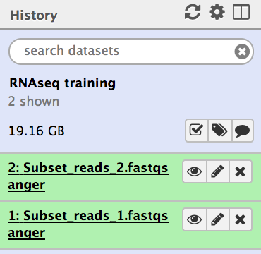
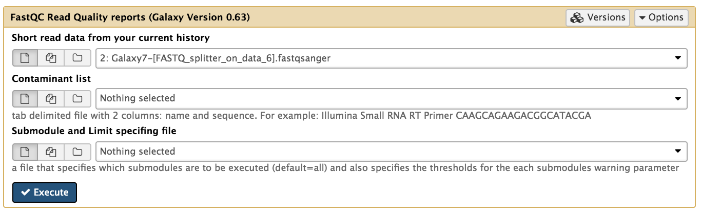
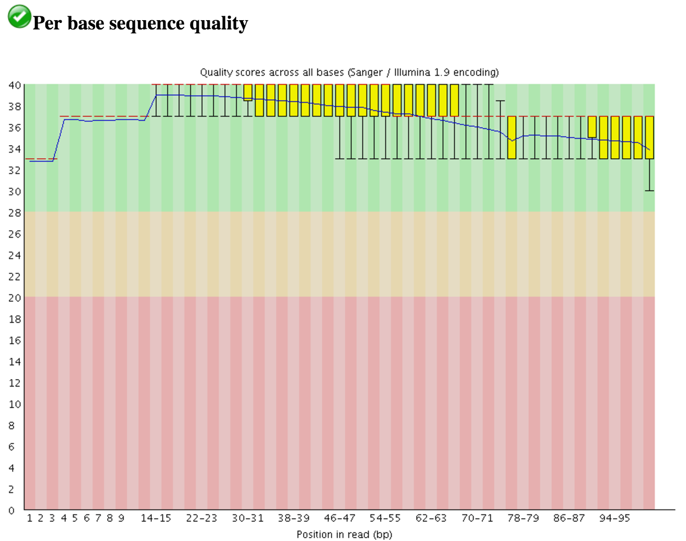
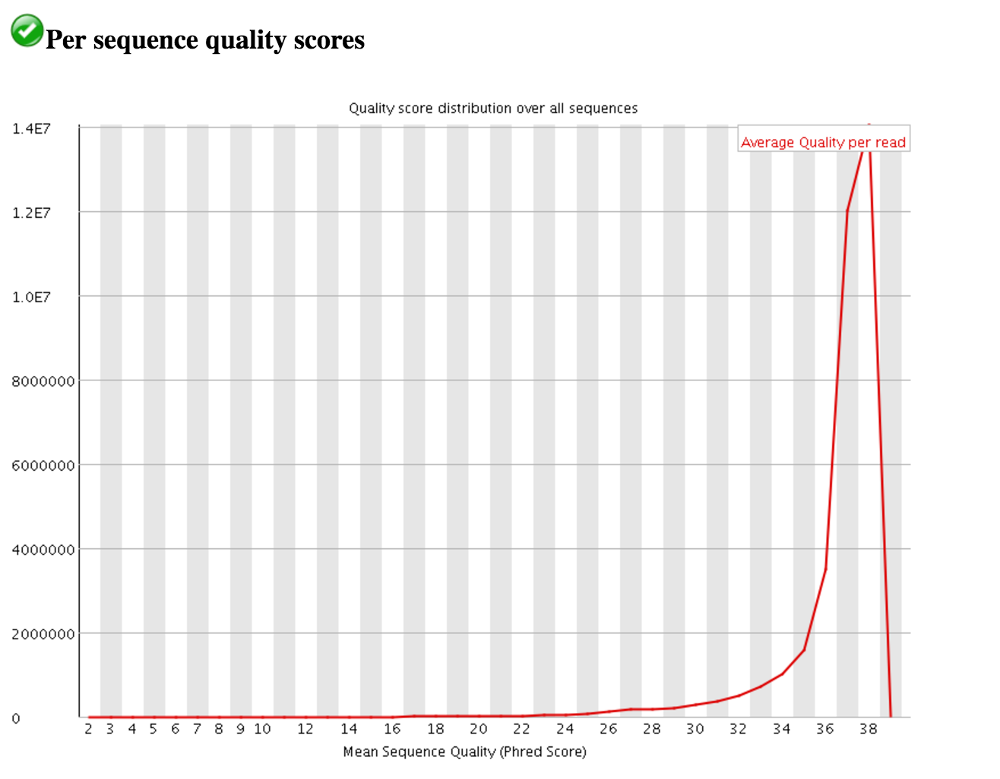
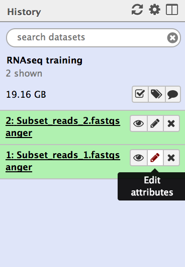
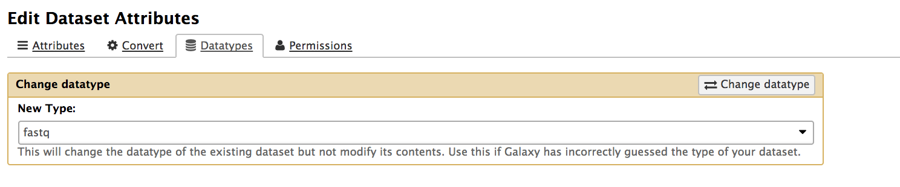
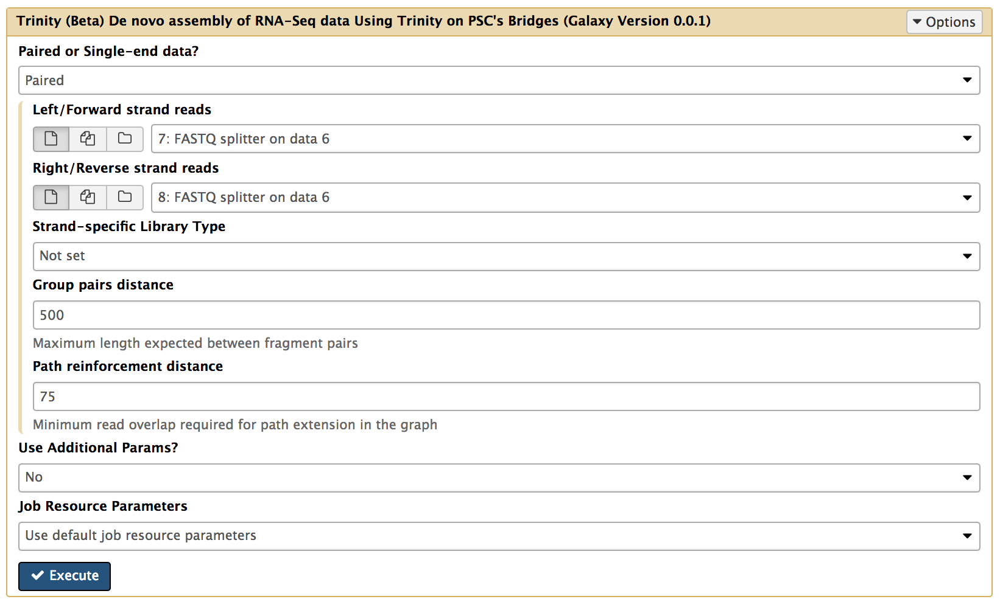
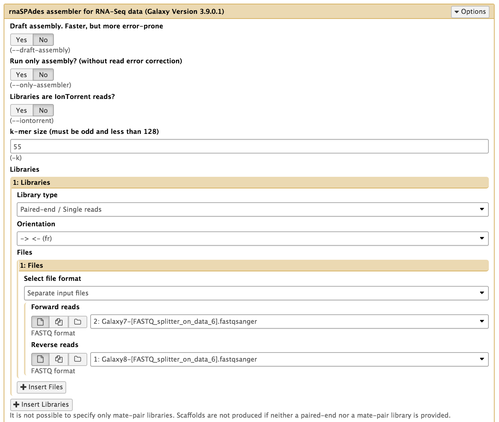

# Introduction

RNA-seq have a broad range of applications, and answer a wide variety of biological questions.
Most analyses are made through the analysis of read counts and variations per sites. This can be made simply my mapping the reads on an existing transcriptome reference.
If no transcriptome reference is available, The first step of RNAseq analysis is to reconstruct the transcriptome from the sequenced reads.
This can be made through a mapping of the reads on a genome reference or a *denovo assembly*.

, two paths can be followed depending on the available references (in green). If an existing transcriptome is available, you can map the read on the transcriptome and perform a quatitative analysis based on the read counts. If no transcriptome is available you need to assemble one. If a Genome is available, you can assemble the transcriptome by mapping the reads on the genome, otherwise you have to performe a denovo transcriptome assembly. Once you have assembles your transcriptome, you can perform your quantitative analysis using the read counts")

The assembly and analysis of the transcriptome is often a good option to study non model organisms, as it is easier and cheaper than assembling a whole genome.

During a transcriptome assembly, the cDNA sequence reads are assembled into transcripts by a short read transcript assembly program.
Although the transcriptome assembling methods are similar to those used in assembling genomes, transcriptome assembly presents some unique challenges. While a high sequence coverage for a genome could indicate repetitive sequences, for a transcriptome, they can indicate high expression levels. In addition, transcriptome sequencing can be strand-specific, due to the possibility of both sense and antisense transcripts. Finally, it can be difficult to reconstruct and differentiate splicing isoforms.

Assemblers generally use one of two basic algorithms: overlap graphs and de Bruijn graphs. Overlap graphs are utilized for most assemblers designed for Sanger sequenced reads. 

## Quality Control

The quality of Illumina reads can be assessed with tools such as [FastQC](http://www.bioinformatics.babraham.ac.uk/projects/fastqc). A wide variety of tools can be used to improve the quality of the reads that won't be discussed in this tutorial (More info [here](https://galaxyproject.org/tutorials/ngs/)).

## Assembly With Trinity

Trinity assembler first divides the sequence data into a number of de Bruijn graphs, each representing transcriptional variations at a single gene or locus. It then extracts full-length splicing isoforms and distinguishes transcripts derived from paralogous genes from each graph separately. 

Trinity consists of three independent software modules, which are used sequentially to produce transcripts:
> *     **Inchworm** Assembles initial contigs by “greedily” extending sequences with most abundant K-mers.
> *     **Chrysalis** Clusters overlapping Inchworm contigs, builds de Bruijn graphs for each cluster, partitions reads
between clusters.
> *     **Butterfly** resolves alternatively spliced and paralogous transcripts independently for each cluster (in parallel)

 Inchworm assemble reads in collection of linear contigs with each k-mers present only once in each contig. (<b>b</b>) Chrysalis pool contigs if they share at least one k – 1-mer and if reads span the junction between contigs, and then it builds individual de Bruijn graphs from each pool. (<b>c</b>) Butterfly takes each de Bruijn graph from Chrysalis and trims spurious edges and compacts linear paths. It then reconciles the graph with reads and pairs, and outputs one linear sequence for each splice form and/or paralogous transcript represented in the graph. (Figure from <a href='https://doi.org/10.1038/nbt.1883'>Grabherr:2011</a>)")

## Assembly with RNASpades

[RNASpades](http://cab.spbu.ru/software/rnaspades/) is a modified version of the Spades tool for genome assembly dedicated to *de novo* transcriptome assembly.
You can find more informations on the Spades method here : * [De Bruijn Graph Assembly](https://galaxyproject.github.io/training-material/topics/assembly/tutorials/debruijn-graph-assembly/slides.html#46) 

## Assembly Quality 

## Let's try it

> ### Agenda
>
> In this tutorial, we will deal with:
>
> 1. [Get the data](#get-the-data)
> 2. [Assess reads quality](#assess-read-quality)
> 3. [Assembly with Trinity](#assemble-with-unicycler)
> 4. [Assembly with RNASpades](#quast)
> 5. [Assess Assembly Quality](#annotate-with-prokka)
> 6. [Visualize the results](#visualize-the-result)
{: .agenda}

### <a name="get-the-data">Get the data

In this example we will use a downsampled version of *E. coli* C Illumina and ONT sequencing data. These include 3 files: forward and reverse reads for Illumina, and Long read file produced by ONT.

Here is what to do to load the data:

> ### :pencil2: Hands-on: Getting the data
>
> 1. Create and name a new history for this tutorial.
> 2. From the left panel, click on the **Get data icon** :
> 
> 3. From the **Get data** panel, select the local files (downloaded from zenodo) and click on **Start** to upload them
> 
>
>    > ### :bulb: Tip: Uploading Files from Url
>    >
>    > * Instead of clicking on the **Choose Local File** button, click on **Paste/Fetch data**
>    > * Copy the files Urls in the text area 
>    > * Click on the **Start** button
>    {: .tip}
> 4. Once the files have been uploaded, change their types to fastqsanger 
>
>    > ### :bulb: Tip: Changing a dataset datatype
>    >
>    > * Click on the pencil icon of the dataset in the history 
>    > * Open the Datatype tab
>    > * Change the data-type to **fastqsanger**
>    > * Save
>    {: .tip}
>
>
{: .hands_on}

The datasets will appear in your history:

### <a name="assess-read-quality">Assess Read Quality

You can assess the quality of Illumina reads by using FastQC.

FastQC will provide you with an html report about your read quality. In addition to basic informations about the data (type of file, encoding read range of lengths and percentage of GC in the sequences), the report contains graphs for several quality metrics. One of them is a boxplot showing the sequence quality per base. 

Another plot shows the quality per sequence.

### Assembly with Trinity 

The Trinity tool takes fastqsanger files as inputs. If your files are identified as generic fastq files you will need to change the type of your files.

Repeat the process for the two datasets.

You can now run Trinity to perform the assembly with the following parameters: 

* **Paired or Single end data?** : Select the appropriate option to describe you data. In this example we are using Paired end Data.
* **Select first set of reads** : Specify the dataset containing the forward reads, often specified by a "-1" in the file name, but specified here by the "_1".
* **Select second set of reads** : Specify the dataset containing the forward reads, often specified by a "-2" in the file name, but specified here by the "_2".

Trinity returns two output files: 

### Assembly with RNASpades 

The RNASpades tool takes fastqs files as inputs. If your files are identified as fastqsanger files you will need to change the type of your files.

You can now run RNAspades to perform the assembly with the following parameters: 

* **Paired or Single end data?** : Select the appropriate option to describe you data. In this example we are using Paired end Data.
* **Select first set of reads** : Specify the dataset containing the forward reads, often specified by a "-1" in the file name, but specified here by the "R1".
* **Select second set of reads** : Specify the dataset containing the forward reads, often specified by a "-2" in the file name, but specified here by the "R2".
* **Select long reads** : Optional, here specify you Oxford Nanopore dataset.

