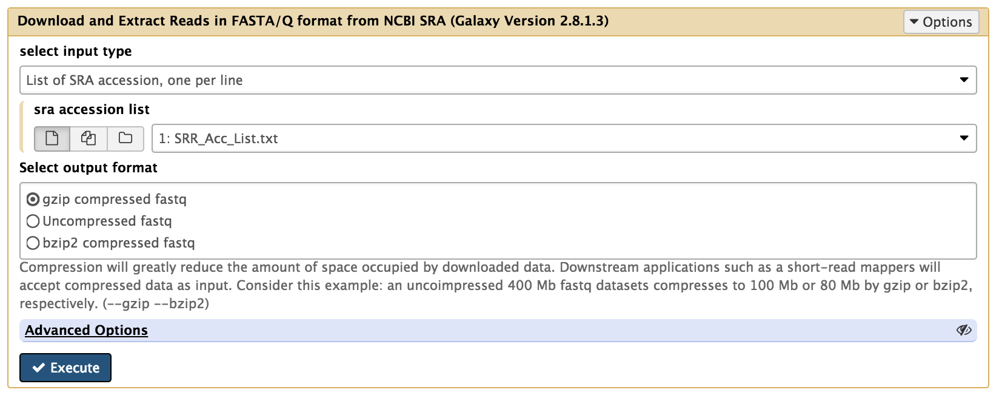
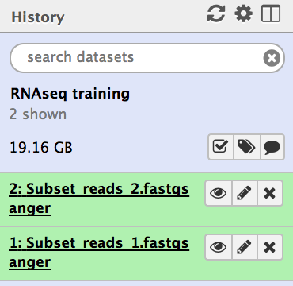
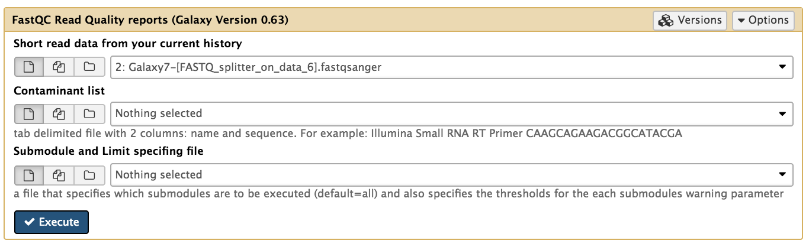
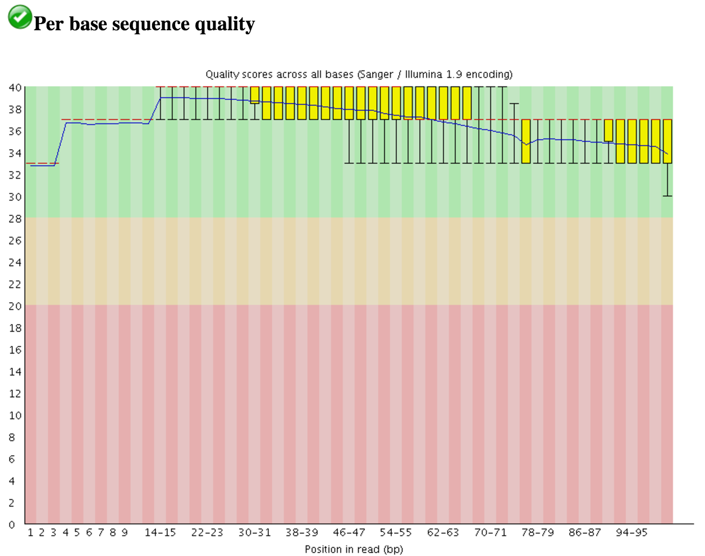
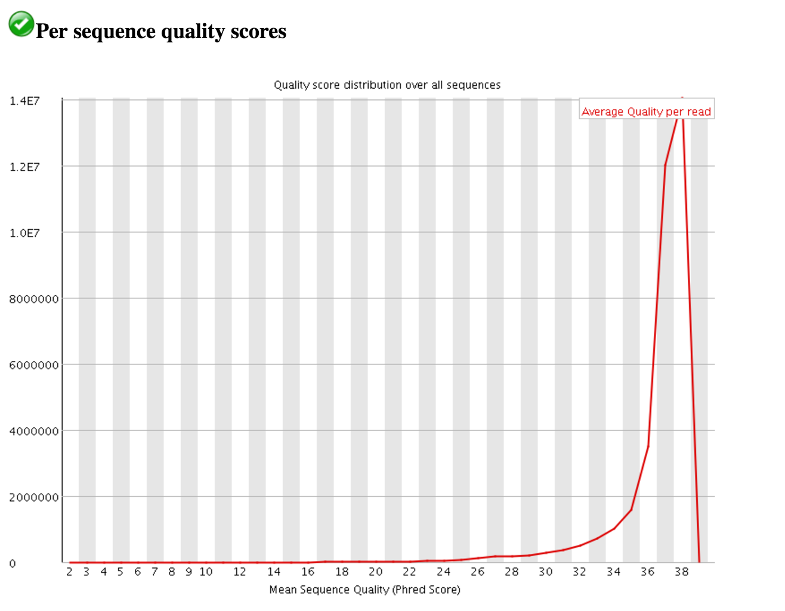
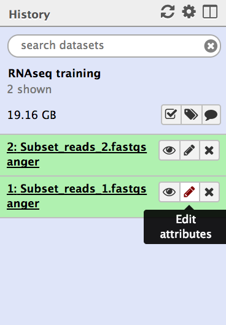
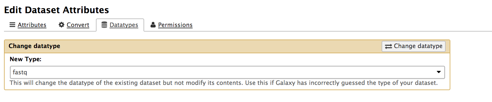
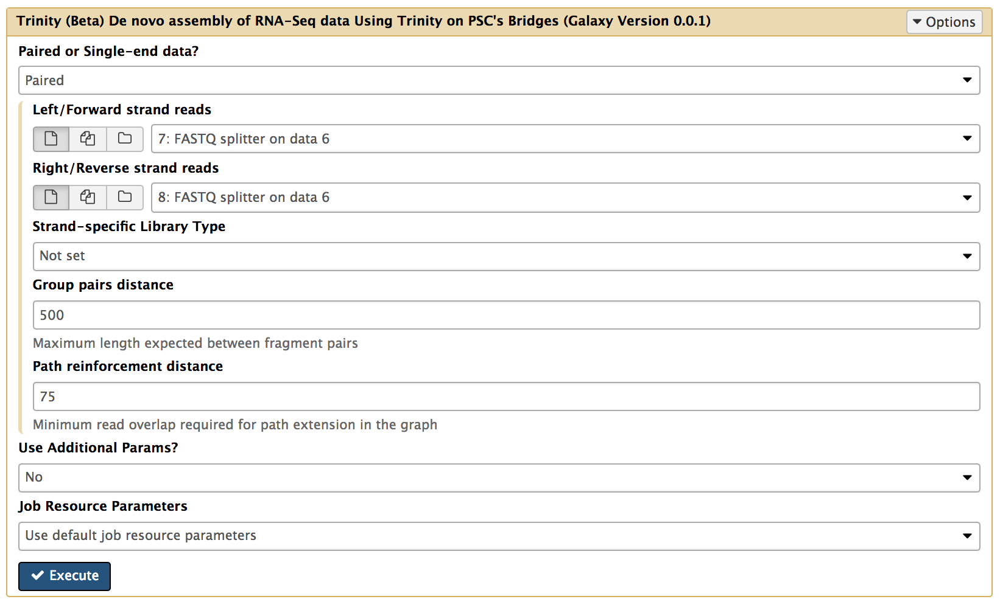
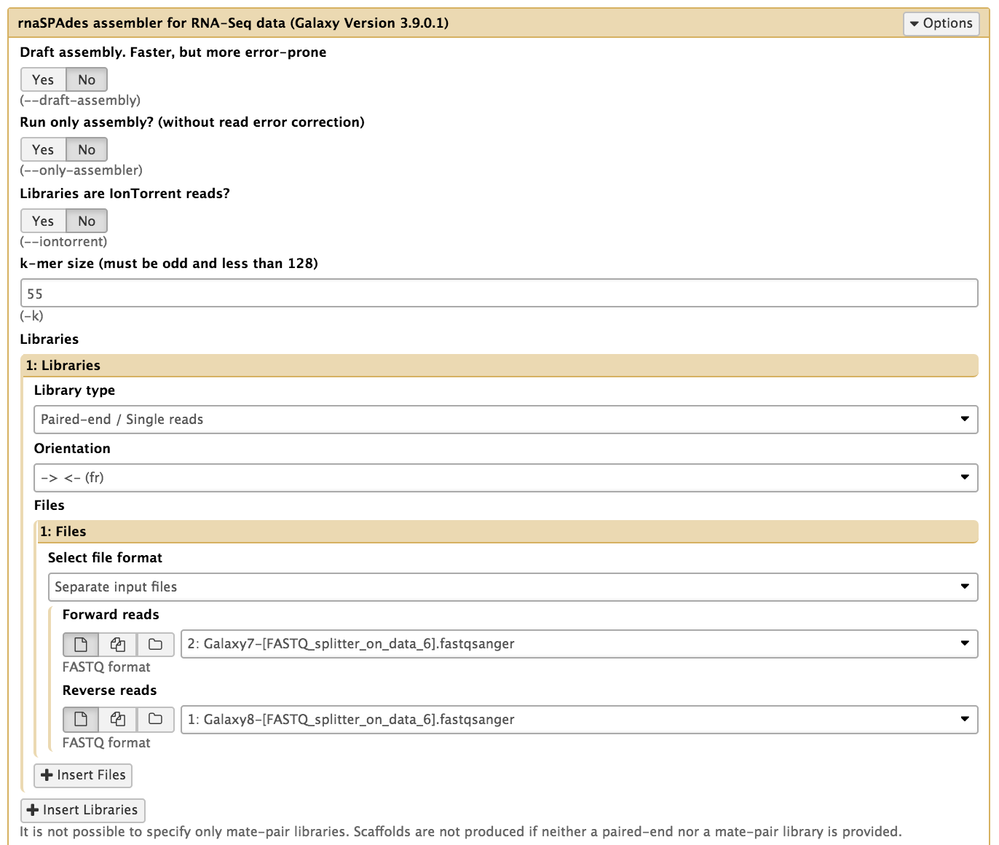

# Introduction

RNA-seq have a broad range of applications, and answer a wide variety of biological questions.

The type of information you can get from RNAseq can be of broadly two type: Qualitative and quantitative data : 
*   Qualitative: Includes identification of expressed transcripts or intro/exon boundaries, transcriptional start sites (TSS), and poly-A sites... Can also be referred to as annotation. The most important parameter in these analyses is that the reads cover evenly the transcripts. 
*   Quantitative : Includes measurement of difference of expression, alternative splicing, alternative TSS, and alternative polyadenylation between two or more treatments or groups... 

Most analyses are made through the analysis of read counts and variations per sites. This can be made simply my mapping the reads on an existing transcriptome reference.
If no transcriptome reference is available, The first step of RNAseq analysis is to reconstruct the transcriptome from the sequenced reads.
This can be made through a mapping of the reads on a genome reference or a *denovo assembly*.

, two paths can be followed depending on the available references (in green). If an existing transcriptome is available, you can map the read on the transcriptome and perform a quatitative analysis based on the read counts. If no transcriptome is available you need to assemble one. If a Genome is available, you can assemble the transcriptome by mapping the reads on the genome, otherwise you have to performe a denovo transcriptome assembly. Once you have assembles your transcriptome, you can perform your quantitative analysis using the read counts")

> ### :pencil2: Typical Analysis pipeline
>
> 1. Initial processing : Demultiplex, filter, and trim sequencing reads.
> 2. Normalize sequencing reads (if performing de novo assembly)
> 3. de novo assembly of transcripts (if a reference genome is not available) or Map (align) sequencing reads to reference genome or transcriptome
> 4. Annotate transcripts assembled or to which reads have been mapped
> 5. Count mapped reads to estimate transcript abundance
> 6. Perform statistical analysis to identify differential expression (or differential splicing) among samples or treatments
> 7. Perform multivariate statistical analysis/visualization to assess transcriptome-wide differences among samples. 
>
{: .hands_on}

## Initial Processing  

The reads must go through a number of step before de novo assembly or mapping on a reference.

The steps are the following : 
*   Demultiplex by index or barcode
*   Remove adapter sequences
*   Trim reads by quality
*   Discard reads by quality/ambiguity
*   Filter reads by k-mer coverage
*   Normalize k-mer coverage

A wide variety of tools can be used to improve the quality of the reads, you can find more info [here](https://galaxyproject.org/tutorials/ngs/).

#### Demultiplexing

Multiplexing is the pooling of several different samples into a single pool of molecules read by the sequencer

"Multiplexing of samples is made possible by incorporation of a short (usually at least 6 nt) index or "barcode"; into each DNA fragment during the adapter ligation or PCR amplification steps of library preparation. After sequencing, each read may be traced back to its original sample using the index sequence and binned accordingly. Depending on the library preparation method and sequencing technology, the sequencing instrument software may or may not perform the partitioning. "

Tools : Kraken, deindexer, Drop-seq, Bayexer, Sabre

In galaxy : Kraken, 

#### Removing adapter

"If cDNA insert sizes are sufficiently small and sequencing read lengths sufficiently long, it is possible to generate sequencing reads that contain a portion of adapter sequence at the 3′-end. Therefore, depending on the library preparation method and range of cDNA insert sizes, it may be prudent to trim these artifacts away. Removing these artifacts should improve assembly and/or mapping of sequencing reads. "

Tools : cutadapt, The FASTX-toolkit, Scythe, FAR, BBDuk, clean_reads, condetri, Deconseq, bowtie, htSeqTools, Sabre

In Galaxy : cutadapt, fastx, Scythe, bowtie, 

#### Filtering/trimming

Quality control : AfterQC, FastQC, fastqp, Kraken, HTSeq, mRIN, MultiQC, NGS QC Toolkit, PRINSEQ, RNA-SeQC, Trim galore, 

Tools filtering/trimmimg : AfterQC, NGS QC Toolkit, Sickle, Trimmomatic

In Galaxy : FastQC, Kraken, HTSeq, MultiQC, bamqc, PRINSEQ,  Trim galore, Trimmomatic

#### Error Correction

Tools : AmpliconNoise, BayesHammer, QuorUM, GeneScissors, 

For this tutorial we will use already processed reads.

> ### Agenda
>
> In this tutorial, we will deal with:
>
> 1. TOC
> {:toc}
>
{: .agenda}

## Quality Control

The quality of Illumina reads can be assessed with tools such as [FastQC](http://www.bioinformatics.babraham.ac.uk/projects/fastqc) and [MultiQC](http://multiqc.info/) that will be used in this tutorial. 

#### FasQC

FastQC is a tool providing Quality control of reads. It output several different graph representing the quality of base call per base, per reads, per sequencing cells... 

## Assembly 
The assembly and analysis of the transcriptome is often a good option to study non model organisms, as it is easier and cheaper than assembling a whole genome.

During a transcriptome assembly, the cDNA sequence reads are assembled into transcripts by a short read transcript assembly program.
Although the transcriptome assembling methods are similar to those used in assembling genomes, transcriptome assembly presents some unique challenges. While a high sequence coverage for a genome could indicate repetitive sequences, for a transcriptome, they can indicate high expression levels. In addition, transcriptome sequencing can be strand-specific, due to the possibility of both sense and antisense transcripts. Finally, it can be difficult to reconstruct and differentiate splicing isoforms.

Assemblers generally use one of two basic algorithms: overlap graphs and de Bruijn graphs. Overlap graphs are utilized for most assemblers designed for Sanger sequenced reads. 

### Trinity

If a genome reference is available, Trinity uses it to aligne reads, partitions them according to locus,  and then assemble the transcriptome de novo per locus.

If no reference is available, Trinity can perform a de novo transcriptome assembly.

Trinity assembler is based on De Bruijn graphs and consists of three independent software modules, which are used sequentially to produce transcripts:
> *     **Inchworm** Assembles initial contigs by “greedily” extending sequences with most abundant K-mers.
> *     **Chrysalis** Clusters overlapping Inchworm contigs, builds de Bruijn graphs for each cluster, partitions reads
between clusters.
> *     **Butterfly** resolves alternatively spliced and paralogous transcripts independently for each cluster (in parallel)

 Inchworm assemble reads in collection of linear contigs with each k-mers present only once in each contig. (<b>b</b>) Chrysalis pool contigs if they share at least one k – 1-mer and if reads span the junction between contigs, and then it builds individual de Bruijn graphs from each pool. (<b>c</b>) Butterfly takes each de Bruijn graph from Chrysalis and trims spurious edges and compacts linear paths. It then reconciles the graph with reads and pairs, and outputs one linear sequence for each splice form and/or paralogous transcript represented in the graph. (Figure from <a href='https://doi.org/10.1038/nbt.1883'>Grabherr:2011</a>)")

#### Inchworm 

In the first step of the assembly, Inchworm assemble reads into a unique sequence of transcripts . It uses a greedy k-mer based approach, recovering only a single representative for a set of alternative variants that shares k-mers.  

Inchworn reconstruct linear transcripts contigs in six steps :
>    1. Constructs a k-mer dictionary from all sequence reads (k=25)
>        
>    2. Removes likely error-containing k-mers from the dictionnary
>    3. Select the most frequent k-mer in the dictionnary to seed a contig assembly
>    4. Extend the seed in each direction by finding the most frequently occuring kmer with a k-1 overlap with the current contig terminal region. 
>    5. Extend the contig in either direction until it cannot be extended further, the report the linear contig
>    6. Repeat the process starting with the second most abundant K-mer, until the dictionnary has been exhausted (exclusion of low-complexity and singleton k-mers)

#### Chrysalis 

Chrysalis clusters related contigs that correspond to portions of alternatively spliced transcripts or otherwise unique portion of paralogous genes. It the construct a de Bruijn graph for each cluster of related contigs, each graph representing the overlaps between variants.  

#### Butterfly

### RNASpades

[RNASpades](http://cab.spbu.ru/software/rnaspades/) is a modified version of the Spades tool for genome assembly dedicated to *de novo* transcriptome assembly.
You can find more informations on the Spades method here : * [De Bruijn Graph Assembly](https://galaxyproject.github.io/training-material/topics/assembly/tutorials/debruijn-graph-assembly/slides.html#46) 

## Assembly Quality 

## Annotation

# Let's try it

## Get the data

In this example we will use a downsampled version of *E. coli* C Illumina and ONT sequencing data. These include 3 files: forward and reverse reads for Illumina, and Long read file produced by ONT.

Here is what to do to load the data:

> ### :pencil2: Hands-on: Getting the data
>
> 1. Create and name a new history for this tutorial.
> 2. From the left panel, click on the **Get data icon** :
> 
> 3. From the **Get data** panel, select the local files (downloaded from zenodo) and click on **Start** to upload them
> 
>
>    > ### :bulb: Tip: Uploading Files from Url
>    >
>    > * Instead of clicking on the **Choose Local File** button, click on **Paste/Fetch data**
>    > * Copy the files Urls in the text area 
>    > * Click on the **Start** button
>    {: .tip}
> 4. Use the tool "Download and Extract Reads in FASTA/Q format from NCBI SRA" to download the NCBI files.
> 
> 5. Once the files have been uploaded, change their types to fastqsanger 
>
>    > ### :bulb: Tip: Changing a dataset datatype
>    >
>    > * Click on the pencil icon of the dataset in the history 
>    > * Open the Datatype tab
>    > * Change the data-type to **fastqsanger**
>    > * Save
>    {: .tip}
>
>
{: .hands_on}

The datasets will appear in your history:

## Assess Read Quality

You can assess the quality of Illumina reads by using FastQC.

FastQC will provide you with an html report about your read quality. In addition to basic informations about the data (type of file, encoding read range of lengths and percentage of GC in the sequences), the report contains graphs for several quality metrics. One of them is a boxplot showing the sequence quality per base. 

Another plot shows the quality per sequence.

## Assembly with Trinity 

The Trinity tool takes fastqsanger files as inputs. If your files are identified as generic fastq files you will need to change the type of your files.

Repeat the process for the two datasets.

You can now run Trinity to perform the assembly with the following parameters: 

* **Paired or Single end data?** : Select the appropriate option to describe you data. In this example we are using Paired end Data.
* **Select first set of reads** : Specify the dataset containing the forward reads, often specified by a "-1" in the file name, but specified here by the "_1".
* **Select second set of reads** : Specify the dataset containing the forward reads, often specified by a "-2" in the file name, but specified here by the "_2".

Trinity returns two output files: 

## Assembly with RNASpades 

The RNASpades tool takes fastqs files as inputs. If your files are identified as fastqsanger files you will need to change the type of your files.

You can now run RNAspades to perform the assembly with the following parameters: 

* **Paired or Single end data?** : Select the appropriate option to describe you data. In this example we are using Paired end Data.
* **Select first set of reads** : Specify the dataset containing the forward reads, often specified by a "-1" in the file name, but specified here by the "R1".
* **Select second set of reads** : Specify the dataset containing the forward reads, often specified by a "-2" in the file name, but specified here by the "R2".
* **Select long reads** : Optional, here specify you Oxford Nanopore dataset.

